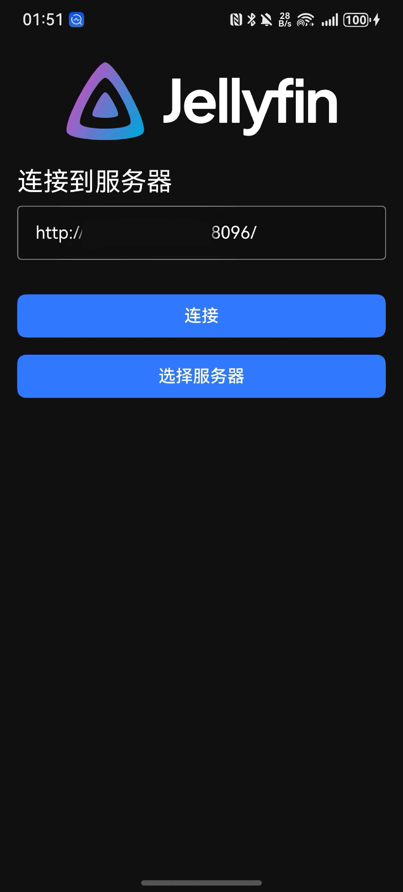
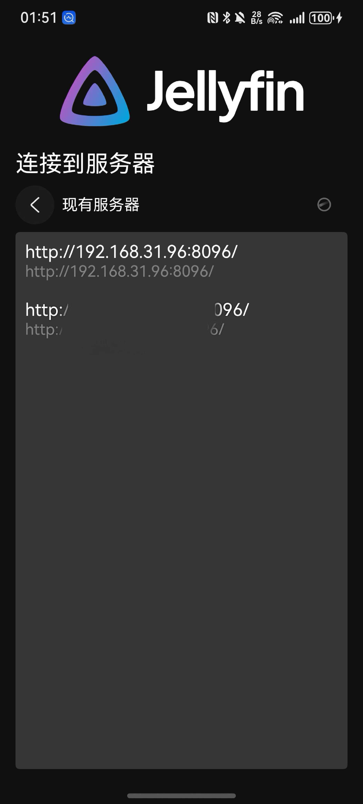
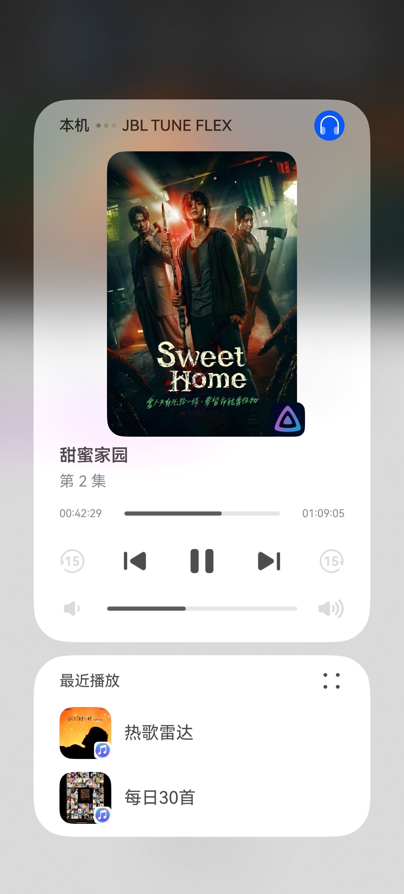
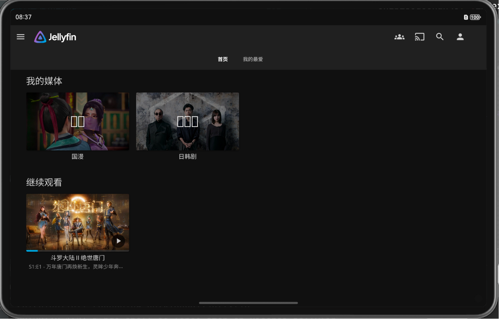
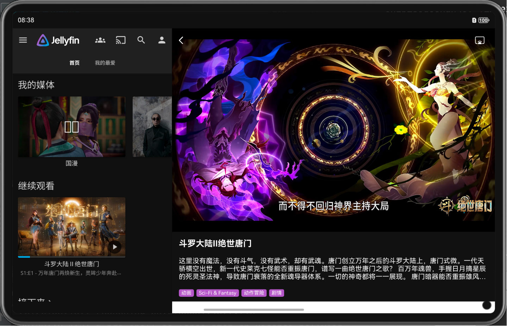
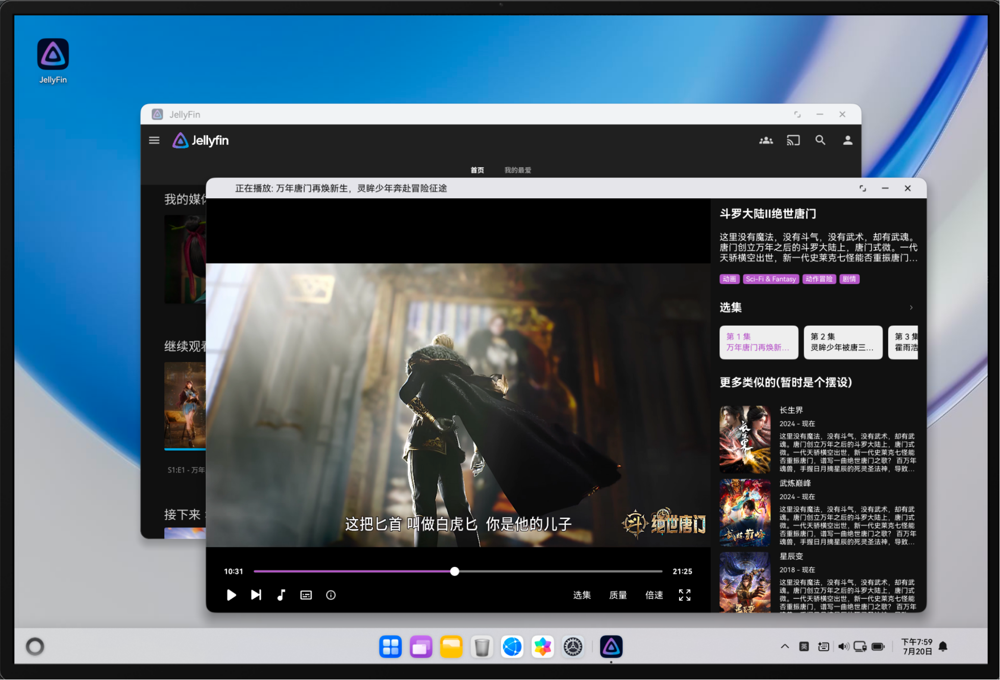
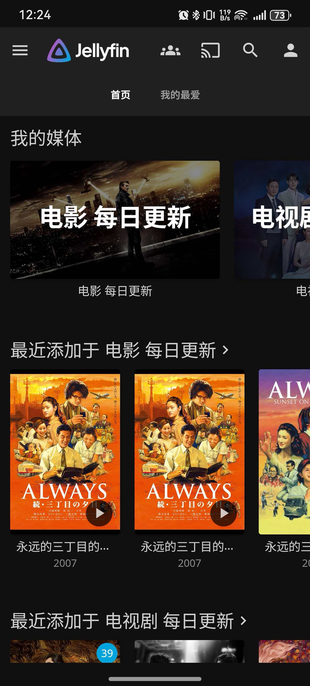
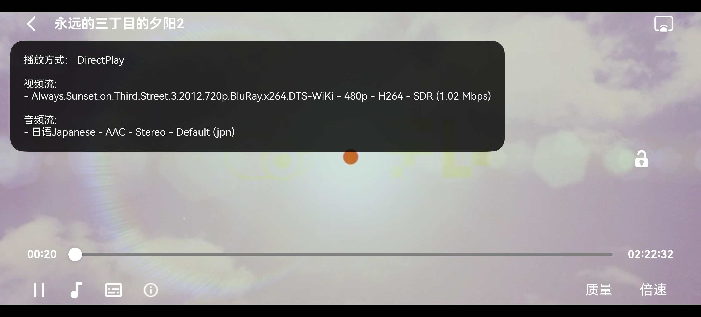

<h1 align="center">JellyFin HarmonyOS</h1>
<h3 align="center">Official client of the <a href="https://jellyfin.org">Jellyfin Project</a></h3>

---

 
 

Jellyfin_HarmonyOS is a HarmonyOS Application that connects to a Jellyfin instance and integrates with the official web client. The specific functionality is implemented with reference to the Android open source code.

## A few words
I wrote this for learning purposes, to improve my HarmonyOS development skills, to make HarmonyOS software accessible to niche users, and to contribute to the development of the HarmonyOS ecosystem.

PS: I wrote this in my free time, so please don't rush me!

## Progress
Since I'm not familiar with the project, I can't say for sure what specific features it will have, and I've never developed audio or video, so there will likely be many bugs.

### Completed

- Connecting to a server
- Switching servers
- Discovering local devices
- Simple playback
- Recording playback progress
- Supporting ASS/SRT subtitles
- Player controls (volume, brightness, progress)
- Speed ​​control
- Playing the default audio/subtitle track
- Next episode
- Play card in the notification bar (AVSession playback control)
- Switching audio tracks
- Switching subtitles
- Switching resolution
- Fullscreen lock
- Casting (AVCast)
- Selecting episodes
- Video information
- Long press for triple speed
- Tablet/PC compatibility
- Support for JellyFin (currently works properly when logging in and loading, supports playback of resources from http://xiaoya.host. The external domain name needs to be mapped to the same port as the internal network. Some videos cannot be accessed due to an outdated JellyFin version and are still under investigation.)

### Unfinished/Planning

#### To be scheduled
- Picture-in-Picture (subtitle plugin issue needs to be resolved)
- Download
- Settings
- More subtitle support
- ...

🧬 Rendering
------------

| Connect to Server | Existing Server | Playback Control |
|:------------------------------------------------------------:|:---------------------------------------------------------------:|:-------------------------------------------------------------:|
|  |  |  |

| Video Playback (Vertical) | Video Playback (Horizontal) |
|:------------------------------------------------------------:|:-------------------------------------------------------------:|
|  |  |

| Tablet Homepage (Horizontal) | Tablet Playback Column |
|:---------------------------------------------------------------:|:---------------------------------------------------------------:|
|  |  |

| PC Playback Window | PC Plays Full Screen |
|:-----------------------------------------------------------------:|:----------------------------------------------------------------:|
|  |  |

| Xiaoya Homepage | Xiaoya Video Plays Horizontally |
|:-----------------------------------------------------------:|:----------------------------------------------------------------:|
|  |  |

## Code Related

- Server-related operations, convert Jellyfin's <a href="https://github.com/jellyfin/jellyfin-sdk-typescript">TypeScript The SDK was ported to HarmonyOS for use.
- After trial use, the player adopted <a href="https://ohpm.openharmony.cn/#/cn/detail/@ohos%2Fijkplayer">ijkPlayer</a>
- The playback control page is modified based on the open source library <a href="https://gitee.com/openharmony-tpc/openharmony_tpc_samples/tree/master/GSYVideoPlayer">GSYVideoPlayer</a>
- The pop-up window uses <a href="https://github.com/xdd666t/ohos_smart_dialog">ohos_smart_dialog</a>

Thanks to the open source community for their selfless contributions!

## Tips

| | |
|:-------------------------------------------------------:|:--------------------------------------------------:|
|  |  |

- If you feel this project has helped you, you can V the author 50 and treat him to a KFC meal.

## Contact Information

- QQ Group: 991893385
